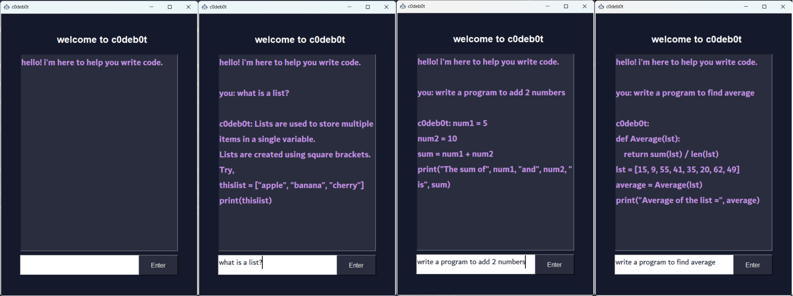

# c0deb0t 

#### A Chat-Bot to help with programming guidance and syntax building 

#### This application was made using [CodeBERT](https://github.com/microsoft/CodeBERT) and tkinter library in python.

### Project By:

- [Khushi Ruparel - @khushi-14](https://github.com/khushi-14)
- [Girish Rajani - @girishrajani](https://github.com/girishrajani)

### Outputs:

#### Disclaimer: This project was developed solely for learning purposes. As of now, the dataset used in this project is relatively small, which might result in unreliable performance.

